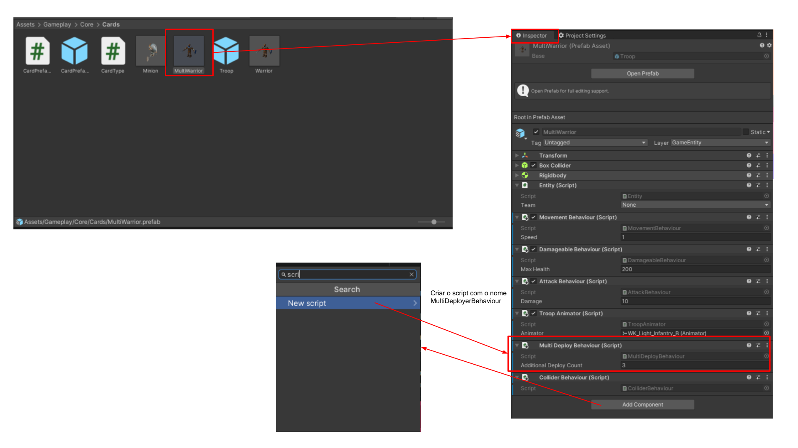
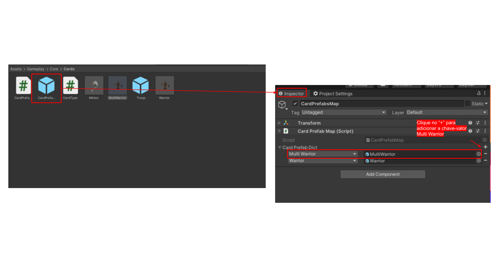
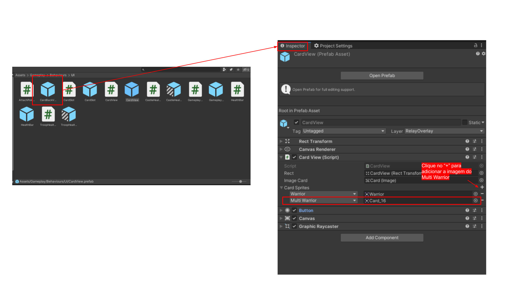

# Documentação

1. Criar um novo tipo de carta no arquivo [CardType.cs](/Assets/Gameplay/Core/Cards/CardType.cs);
```Csharp
namespace Gameplay.Core.Cards
{
    public enum CardType
    {
        Warrior,
        //Novo tipo adicionado
        MultiWarrior, 
    }
}
```

2. No unity criar um novo prefab de personagem na pasta /Assets/Gameplay/Core/Cards (sugestão: copiar um prefab de um personagem existente);
3. Adicionar ao prefab um componente new Script chamado [MultiDeployBehaviour.cs](/Assets/Gameplay/Behaviours/MultiDeployBehaviour.cs);




```Csharp
using UnityEngine;

namespace Gameplay.Behaviours
{
    public class MultiDeployBehaviour : BaseBehaviour
    {
        //Representa a quantidade de personagens adicionais que irá a arena ao arrastar a carta
        [SerializeField] int additionalDeployCount= 2;

        public int AdditionalDeployCount => additionalDeployCount;
    }
}
```
4. No script [Deployer.cs](/Assets/Gameplay/Core/Deployer.cs) existente, checar a quantidade de personagens que devem ser colocados na arena; 

```Csharp
    public Entity DeployCard(CardType cardType, Team team, int laneIdx)
        {
            var card = GameObjectFactory.CreateCard(cardType, team);

            var lane = Arena.Lanes[laneIdx];

            var damageable = card.GetComponent<IDamageable>();

            AddCard(card, lane, team, damageable);

            var multiDeployBehaviour = card.GetComponent<MultiDeployBehaviour>();
            //Checa se a carta possui o comportamento multi deploy 
            if (multiDeployBehaviour != null)
            {
                for (var i = 0; i < multiDeployBehaviour.AdditionalDeployCount - 1; i++)
                {
                    var additionalCard = GameObjectFactory.CreateCard(cardType, team);

                    AddCard(additionalCard, lane, team, damageable);
                }
            }

            return card;
        }

        private void AddCard(Entity card, Lane lane, Team team, IDamageable damageable)
        {
            lane.AddEntity(card, team);

            if (damageable != null)
            {
                GameplayHUD.CreateHealthBar(damageable, team, card.transform);
            }
        }
```
5. No Unity, acessar a pasta /Assets/Gameplay/Core/Cards e no CardPrefabsMap.prefab ir em Inspector na aba Card Prefab Map (Script) em Card Prefab Dict e associar o novo tipo (Multi Warrior) ao prefab;
o prefab



6. No Unity, acessar a pasta /Assets/Gameplay/Behaviours/UI/CardView e no CardView.prefab ir em Inspector na aba Card View (Script) em Card Sprites e associar o novo tipo (Multi Warrior) a uma imagem;




